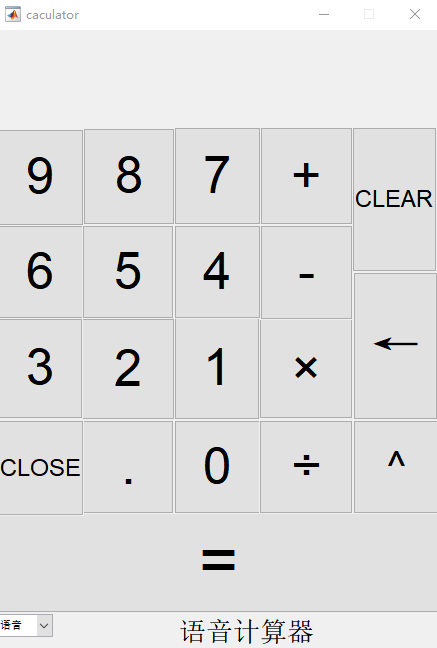
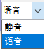
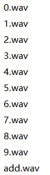
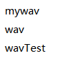

# calculator-matlab
a calculator devoloped with matlab

一款使用matlab编写的语音计算器，界面如下图，可以设置语音模式和静音模式：

- calculator.m中为计算器软件实现代码
- calculator.fig为界面设计文件

语音文件为wav格式，用于按键时的发音：

此外，在wav文件夹中另存了三种wav计算器语音文件，用于替换不同声音的语音播报。

